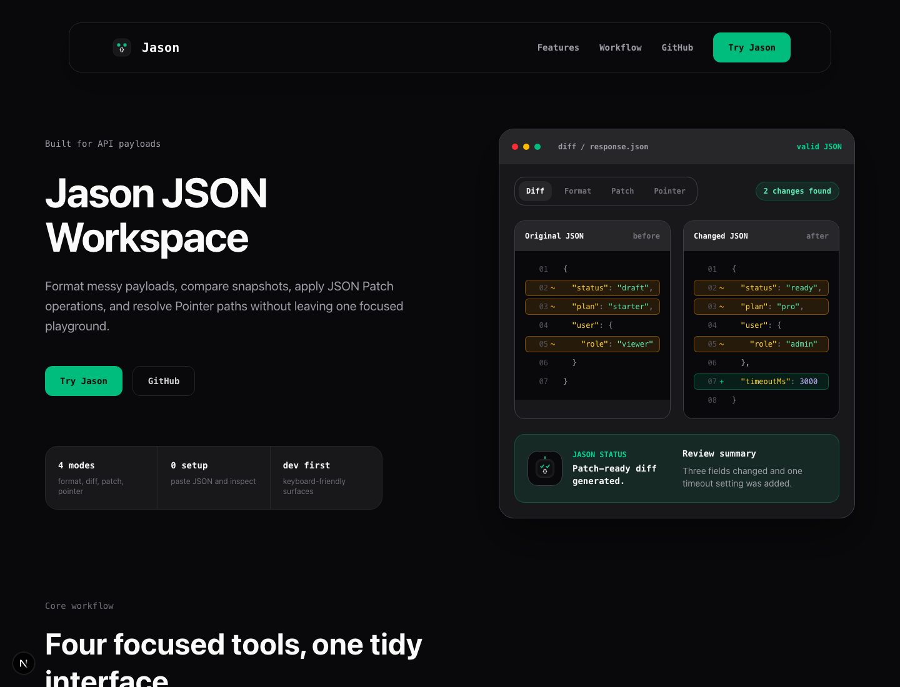
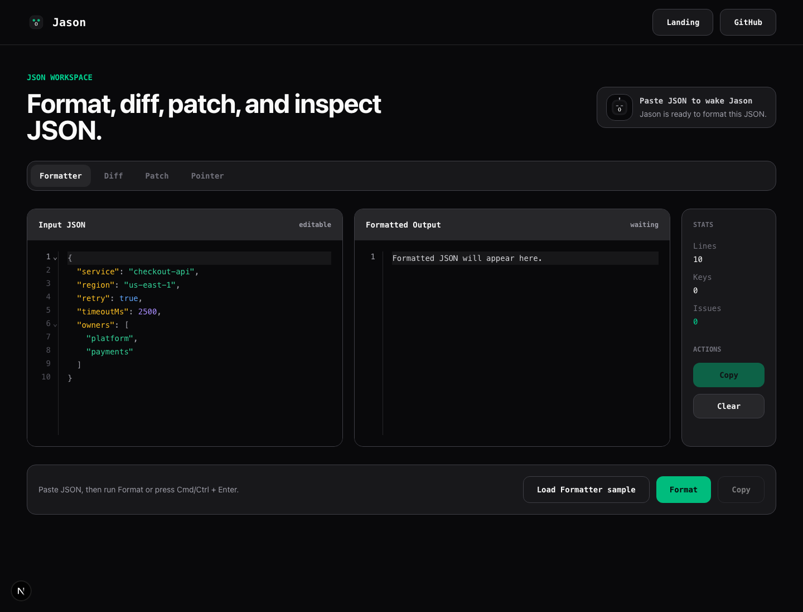

# Jason App

Jason is a focused JSON workspace for formatting, diffing, patching, and
inspecting structured data. The project pairs a polished Next.js playground
with a NestJS API that delegates the core JSON operations to the Jason Rust CLI.

The goal is intentionally small: make common JSON chores feel fast, readable,
and safe enough for real use while showcasing a full-stack product build.

## Why this exists

Developers spend a surprising amount of time staring at API payloads, config
files, webhook bodies, and snapshots. Jason brings the common operations into
one interface:

- Format pasted JSON into clean, readable output.
- Compare two JSON documents and generate JSON Patch operations.
- Apply JSON Patch operations to a document.
- Resolve a JSON Pointer path and inspect the selected value.

## Product surface

- Landing page: explains the product and routes visitors into the playground.
- Playground: interactive workspace with Formatter, Diff, Patch, and Pointer
  tools.
- Backend API: validates requests, calls the Jason CLI, and returns UI-friendly
  summaries.
- CLI boundary: keeps the Rust implementation reusable outside the web app.

## Visual Tour

### Landing Page



### Playground



## Tech stack

- Frontend: Next.js, React, TypeScript, Tailwind CSS, CodeMirror.
- Backend: NestJS, TypeScript.
- Core engine: Jason Rust CLI, exposed to the backend through `JASON_CLI_PATH`.

## Repository layout

```text
.
|-- backend/    # NestJS API for JSON operations
|-- frontend/   # Next.js product site and playground
|-- docs/       # Product and launch notes
`-- terraform/  # Infrastructure experiments and deployment notes
```

## Local development

Jason runs as two apps: the backend API on port `3000` and the frontend on port
`3001`.

### 1. Configure the backend

```bash
cd backend
cp .env.example .env
pnpm install
pnpm run start:dev
```

The backend expects a `jason` CLI binary to be available on `PATH`, or for
`JASON_CLI_PATH` in `backend/.env` to point to a built binary.

### 2. Configure the frontend

```bash
cd frontend
cp .env.example .env.local
pnpm install
pnpm run dev -- -p 3001
```

Open `http://localhost:3001` and use `/playground` for the interactive tools.

## Environment variables

Backend:

- `PORT`: API server port. Defaults to `3000`.
- `FRONTEND_ORIGIN`: comma-separated origins allowed by CORS. Defaults to
  `http://localhost:3001`.
- `JASON_CLI_PATH`: path to the Jason CLI binary. Defaults to `jason`.

Frontend:

- `JASON_API_BASE_URL`: backend API base URL used by the frontend server proxy.
  Defaults to `http://localhost:3000`.
- `JASON_API_AUDIENCE`: optional Cloud Run identity-token audience for private
  backend calls. Defaults to `JASON_API_BASE_URL`.

## API overview

The backend exposes four JSON endpoints:

- `GET /health` for deployment health checks.
- `POST /format` with `{ "input": "..." }`
- `POST /diff` with `{ "before": "...", "after": "..." }`
- `POST /patch` with `{ "document": "...", "patch": "..." }`
- `POST /pointer` with `{ "document": "...", "path": "..." }`

All endpoints return structured responses designed for the playground UI.

## Deployment

See [docs/deployment.md](docs/deployment.md) for the production runbook,
environment checklist, health-check contract, and smoke-test steps.

## Infrastructure

The first IaC target is GCP Cloud Run managed with Terraform. See
[docs/decisions/0001-gcp-cloud-run-terraform.md](docs/decisions/0001-gcp-cloud-run-terraform.md)
for the hosting decision, cost controls, alternatives, and rollout plan.

Container images are published manually through the `Publish Container Images`
GitHub Actions workflow once GCP Workload Identity and Artifact Registry writer
access are configured.

Terraform plans can be reviewed through the manual `Terraform Plan` workflow
after an image tag is published.

Destroy plans can be reviewed through the manual `Terraform Destroy Plan`
workflow before any teardown is considered.

Terraform deploys are manual through the `Terraform Deploy` workflow. It plans,
opens an approval issue, then applies the exact plan only after an approval
comment such as `yes`, `lgtm`, or `done`.

Use a GCS bucket for Terraform state before the first real GitHub Actions apply.

## Architecture

See [docs/architecture.md](docs/architecture.md) for the product problem,
system design, CLI boundary, tradeoffs, and future improvements.

## Launch roadmap

This repo is being prepared in small, reviewable PRs:

1. Public README and setup docs.
2. Playground usability polish and sample data.
3. Landing page links, copy, and docs route cleanup.
4. Production deployment path for frontend, backend, and CLI binary.
5. Recruiter-ready screenshots, architecture notes, and release checklist.

## Current status

Jason is ready for local demo work. The next launch milestone is making the
playground easy to evaluate from a fresh clone and safe to deploy on the web.
