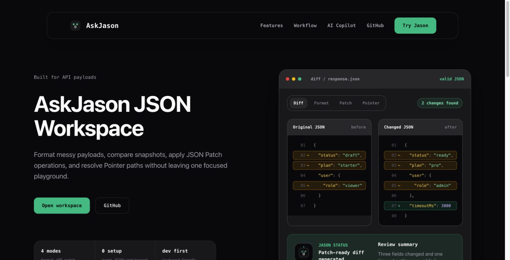
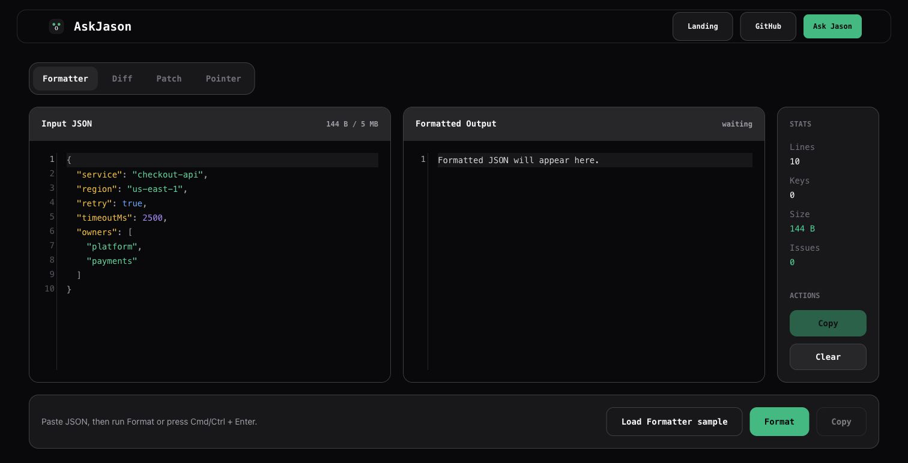
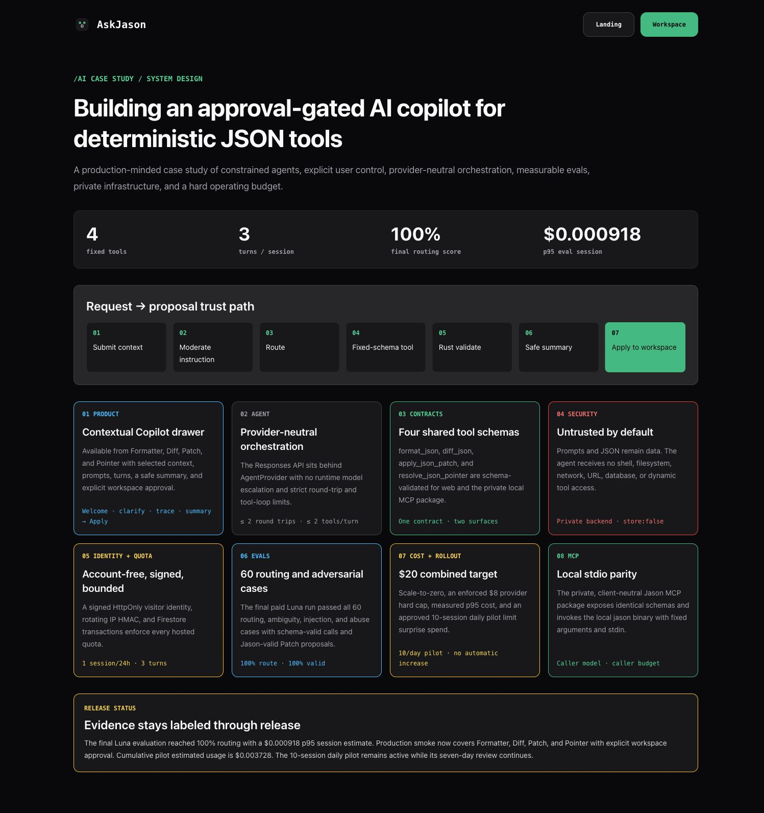

# AskJason

AskJason is a focused JSON workspace for formatting, diffing, patching, and
inspecting structured data. The project pairs a polished Next.js playground
with a NestJS API that delegates the core JSON operations to the Jason Rust CLI.
An optional approval-gated AI copilot can route natural-language requests to
the same four deterministic tools without changing the workspace until the
user explicitly applies a validated proposal.

The goal is intentionally small: make common JSON chores feel fast, readable,
and safe enough for real use while showcasing a full-stack product build.

## Why this exists

Developers spend a surprising amount of time staring at API payloads, config
files, webhook bodies, and snapshots. AskJason brings the common operations into
one interface:

- Format pasted JSON into clean, readable output.
- Compare two JSON documents and generate JSON Patch operations.
- Apply JSON Patch operations to a document.
- Resolve a JSON Pointer path and inspect the selected value.

## Product surface

- Landing page: explains the product and routes visitors into the playground.
- Playground: interactive workspace with Formatter, Diff, Patch, and Pointer
  tools.
- Backend API: validates requests, calls the Jason CLI, and returns UI-friendly
  summaries.
- AskJason copilot: offers constrained, proposal-only guidance through four
  fixed-schema tools while preserving explicit Apply/Discard control.
- AI case study: documents the trust path, evaluation results, privacy boundary,
  and rollout controls at `/ai`.
- CLI boundary: keeps the Rust implementation reusable outside the web app.
- Local MCP server: exposes the same deterministic tool contracts over stdio
  without hosted AI access.

## Visual Tour

### Landing Page



### Playground



### AI Architecture



## Tech stack

- Frontend: Next.js, React, TypeScript, Tailwind CSS, CodeMirror.
- Backend: NestJS, TypeScript, Firestore-backed AI quota/accounting state.
- Core engine: Jason Rust CLI, exposed to the backend through `JASON_CLI_PATH`.
- Hosted AI: OpenAI Responses and Moderation APIs behind provider-neutral
  backend contracts.
- Infrastructure: GCP Cloud Run, Artifact Registry, Secret Manager, Firestore,
  and Terraform.

## Repository layout

```text
.
|-- backend/    # NestJS API for JSON operations
|-- frontend/   # Next.js product site and playground
|-- docs/       # Architecture, operations, decisions, and release evidence
`-- terraform/  # Production-shaped GCP infrastructure
```

## Local development

Jason runs as two apps: the backend API on port `3000` and the frontend on port
`3001`.

### 1. Configure the backend

```bash
cd backend
cp .env.example .env
pnpm install
pnpm run start:dev
```

The backend expects a `jason` CLI binary to be available on `PATH`, or for
`JASON_CLI_PATH` in `backend/.env` to point to a built binary.

### 2. Configure the frontend

```bash
cd frontend
cp .env.example .env.local
pnpm install
pnpm run dev -- -p 3001
```

Open `http://localhost:3001` and use `/playground` for the interactive tools.

## Environment variables

Backend:

- `PORT`: API server port. Defaults to `3000`.
- `FRONTEND_ORIGIN`: comma-separated origins allowed by CORS. Defaults to
  `http://localhost:3001`.
- `JASON_CLI_PATH`: path to the Jason CLI binary. Defaults to `jason`.

Frontend:

- `JASON_API_BASE_URL`: backend API base URL used by the frontend server proxy.
  Defaults to `http://localhost:3000`.
- `JASON_API_AUDIENCE`: optional Cloud Run identity-token audience for private
  backend calls. Defaults to `JASON_API_BASE_URL`.
- `AI_ENABLED`: exposes the AskJason copilot UI when `true`. The backend must be
  enabled separately with its approved secrets and quota settings.

Hosted AI backend:

- `AI_ENABLED`: enables the hosted agent endpoints. Defaults to `false`.
- `AI_PROVIDER` and `AI_MODEL`: currently restricted to `openai` and
  `gpt-5.6-luna`.
- `OPENAI_API_KEY`: provider credential, supplied from Secret Manager in hosted
  environments.
- `AI_IDENTITY_KEY`: base64-encoded 32-byte key used for signed visitor identity
  and privacy-safe network guards.
- `AI_DAILY_SESSION_LIMIT`: approved daily global cap, restricted to `10` or
  `20`.
- `GOOGLE_CLOUD_PROJECT`: Firestore project for quota and spend ledgers.

## API overview

The backend exposes health, deterministic JSON, and hosted-agent endpoints:

- `GET /health` for deployment health checks.
- `POST /format` with `{ "input": "..." }`
- `POST /diff` with `{ "before": "...", "after": "..." }`
- `POST /patch` with `{ "document": "...", "patch": "..." }`
- `POST /pointer` with `{ "document": "...", "path": "..." }`
- `POST /api/agent/session` to issue a bounded account-free copilot session.
- `POST /api/agent/message` to stream an accepted copilot turn.

The deterministic endpoints return structured responses designed for the
playground UI. The agent endpoints are separately bounded, fail closed, and
return proposals rather than mutating workspace state.

## Performance smoke

Run a small latency baseline against local or deployed services:

```bash
node scripts/perf-smoke.mjs --frontend https://askjason.dev --backend https://YOUR_BACKEND_URL
```

The script checks frontend health, backend health, and formatter latency for
small and large JSON payloads. Use `--help` to see local defaults and tuning
options.

## Deployment

See [docs/deployment.md](docs/deployment.md) for the production runbook,
environment checklist, health-check contract, AI enablement boundary, and
smoke-test steps.

## Infrastructure

The production-shaped IaC target is GCP Cloud Run managed with Terraform. See
[docs/decisions/0001-gcp-cloud-run-terraform.md](docs/decisions/0001-gcp-cloud-run-terraform.md)
for the hosting decision and
[docs/decisions/0002-approval-gated-ai-backend.md](docs/decisions/0002-approval-gated-ai-backend.md)
for the AI trust and infrastructure boundary.

Frontend and backend app changes merged to `master` trigger small path-filtered
deploy workflows. The changed service image is pushed to Artifact Registry and
the matching Cloud Run service image is updated.

Terraform owns infrastructure changes; day-to-day Cloud Run image updates are
handled by the app deploy workflows.

Terraform destroys are manual through the `Terraform Destroy` workflow. Its graph
is also `Plan -> Approval -> Apply`, and the apply job uses the exact saved
destroy plan only after repository-owner approval.

Terraform deploys are manual through the `Terraform Deploy` workflow. Its graph
is `Plan -> Approval -> Apply`, and the apply job uses the exact saved plan only
after a repository-owner approval comment such as `yes`, `lgtm`, or `done`.

Use a GCS bucket for Terraform state before the first real GitHub Actions apply.

## Architecture

See [docs/architecture.md](docs/architecture.md) for the product problem,
deterministic and AI request paths, deployment boundaries, and local MCP
surface. The [documentation index](docs/README.md) identifies the source of
truth for each operational topic.

## Current status

The deterministic workspace is deployed, and the optional AskJason copilot is
running under the bounded ten-session pilot described in
[docs/ai-release-readiness.md](docs/ai-release-readiness.md). The seven-day pilot
review and any wider release or quota increase remain explicit approval gates.
