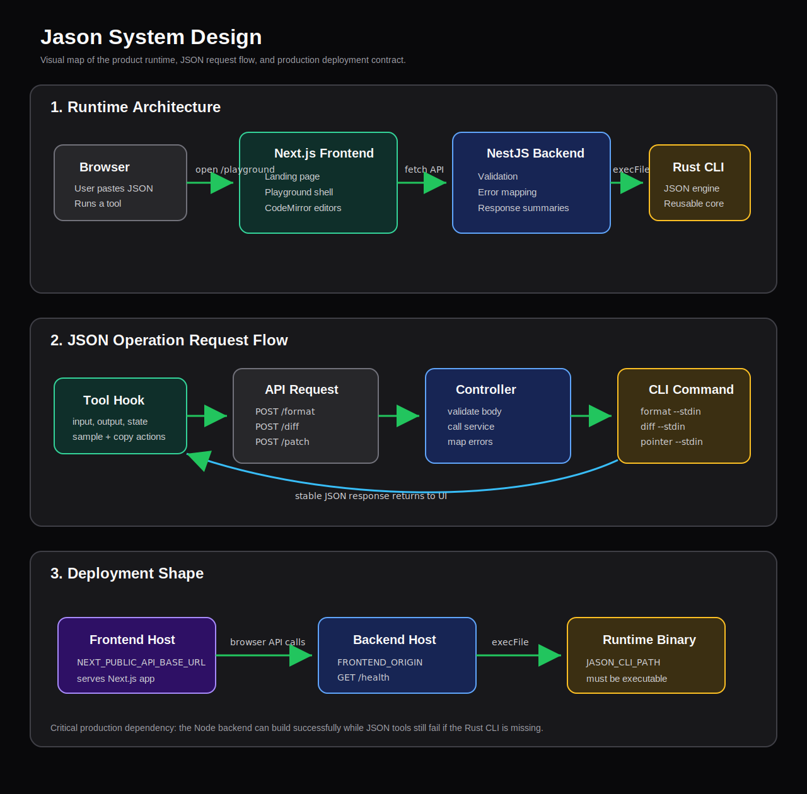

# Jason Architecture

Jason is a small full-stack JSON workspace. The important idea is the boundary:
the browser owns the editing experience, the API owns validation and response
shape, and the Rust CLI owns the JSON operations.

Editable source: [jason-architecture.drawio](./jason-architecture.drawio)

## What The Diagram Shows

The app has three main runtime pieces:

- **Next.js frontend**: landing page, playground shell, CodeMirror editors,
  sample loading, copy actions, and user-facing status.
- **NestJS backend**: request validation, CORS, health checks, error mapping,
  and UI-friendly JSON responses.
- **Jason Rust CLI**: formatter, diff, patch, and pointer operation engine.

## Request Flow

The playground sends JSON operation requests to the backend:

- `POST /format`
- `POST /diff`
- `POST /patch`
- `POST /pointer`

The backend passes each request to the CLI through stdin. CLI output is parsed
or wrapped into a stable API response before returning to the frontend.

## Deployment Shape

The frontend and backend can deploy as separate services. Production needs:

- `NEXT_PUBLIC_API_BASE_URL` on the frontend.
- `FRONTEND_ORIGIN` on the backend for CORS.
- `JASON_CLI_PATH` on the backend so Node can execute the Rust binary.
- `GET /health` configured as the backend health probe.

## Why This Shape

This keeps the project small but still shows real system boundaries: a polished
frontend, a typed API layer, and a reusable CLI engine. It is intentionally more
explicit than hiding everything inside a single Next.js app.
