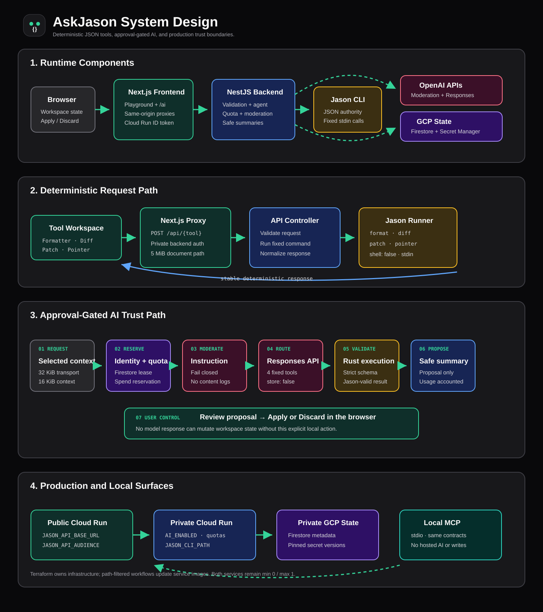

# AskJason architecture

AskJason is a full-stack JSON workspace with two deliberately separate paths:
four deterministic JSON operations and an optional approval-gated copilot that
can propose those same operations. The browser owns workspace state and user
approval, the API owns validation and orchestration, and the Jason Rust CLI owns
JSON semantics.

Editable source: [jason-architecture.drawio](./jason-architecture.drawio)

## Runtime components

- **Next.js frontend**: landing page, `/ai` case study, playground, CodeMirror
  editors, same-origin API proxies, and the explicit Apply/Discard boundary.
- **NestJS backend**: deterministic request validation, agent orchestration,
  moderation, identity and quota enforcement, error normalization, and
  metadata-only AI audit events.
- **Jason Rust CLI**: authoritative Formatter, Diff, Patch, and Pointer engine.
- **OpenAI APIs**: optional hosted moderation and Responses provider behind
  fixed backend interfaces; the model receives exactly four static tool schemas.
- **Firestore**: account-free visitor/network guards, leases, daily and monthly
  quotas, and reserved/actual cost accounting. It stores no prompt, document, or
  provider-response content.
- **Secret Manager**: pinned versions of the provider credential and the
  identity-HMAC root key.
- **Local MCP server**: private stdio adapter over the same four deterministic
  contracts, without hosted AI, filesystem/network tools, or workspace writes.

## Deterministic request path

The playground sends requests to same-origin Next.js routes:

- `POST /api/format`
- `POST /api/diff`
- `POST /api/patch`
- `POST /api/pointer`

The frontend server forwards them to the private backend endpoints `/format`,
`/diff`, `/patch`, and `/pointer`, adding a Cloud Run identity token in hosted
environments. The backend validates the request, invokes the configured Jason
binary with fixed arguments and stdin, and wraps its output in a stable response.

These endpoints retain the independent 5 MiB document contract and continue to
work when the AI feature is disabled, exhausted, or unavailable.

## Approval-gated AI path

1. The user selects bounded JSON context and submits an instruction from any of
   the four playground tools.
2. The Next.js `/api/agent/session` or `/api/agent/message` proxy enforces
   same-origin JSON requests, a 32 KiB transport limit, visitor-cookie forwarding,
   trusted client-IP selection, and private-backend authentication.
3. The backend verifies the signed visitor identity and reserves Firestore
   session, turn, concurrency, and spend capacity before provider access.
4. Moderation evaluates the instruction. The provider then receives untrusted
   request data plus only four fixed-schema JSON tool definitions.
5. Each tool call is strictly validated and executed through the same Jason
   runner used by the deterministic API. No model-selected command or shell is
   available.
6. The backend streams tool metadata and a deterministic safe summary. It does
   not persist or return an automatically applied workspace mutation.
7. The browser changes the selected tool workspace only after the user chooses
   Apply. Discard leaves it unchanged.

Provider calls use bounded rounds and output, `store: false`, and a privacy-safe
safety identifier. Application logs exclude prompts, JSON, and provider response
content; standard Cloud Run request metadata remains under GCP logging controls.

## Deployment shape

The frontend and backend run as separate Cloud Run services:

- The public frontend uses `JASON_API_BASE_URL` and `JASON_API_AUDIENCE` to call
  the private backend with its runtime service account.
- `AI_ENABLED` must agree across frontend and backend for an approved rollout.
- The backend uses `JASON_CLI_PATH`, `AI_PROVIDER`, `AI_MODEL`,
  `AI_DAILY_SESSION_LIMIT`, and `GOOGLE_CLOUD_PROJECT`.
- Provider and identity secrets are mounted from pinned Secret Manager versions.
- Firestore and secret access belong only to the backend runtime identity.
- Both services stay at zero minimum and one maximum instance. Terraform owns
  infrastructure; path-filtered application workflows update image revisions.
- `GET /api/health` and `GET /health` are the frontend and backend probe paths.

## Trust boundaries

- Browser content and model output are untrusted.
- The frontend proxy is a transport and origin boundary, not an authorization to
  mutate a workspace.
- The backend owns quotas, moderation, contracts, provider access, and accounting.
- The Rust CLI is the deterministic authority for every tool result.
- Apply is a local browser decision after proposal review.
- `JASON_CLI_PATH` and local MCP configuration are trusted executable boundaries;
  configure only the pinned Jason binary.

The detailed release evidence, residual risks, and rollout gates live in
[AI release readiness](./ai-release-readiness.md).
